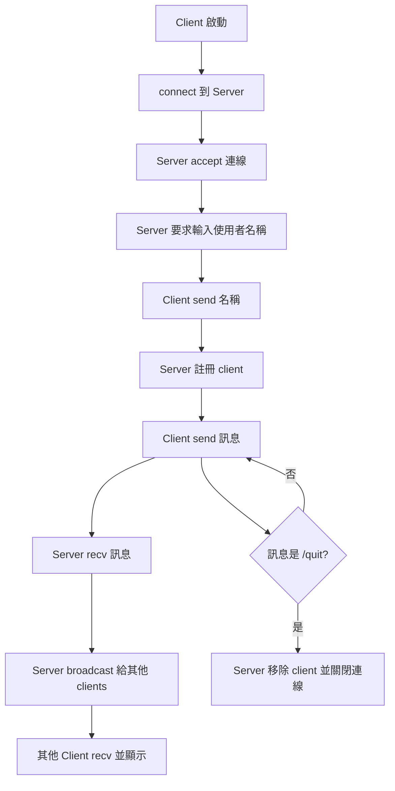

# 簡單聊天室服務程式 (TCP Chat Room)

這個專案實作了一個最小可用的聊天室服務：
- `server.py`: 多執行緒 TCP server，負責接收連線與廣播訊息
- `client.py`: 終端機互動式 client，可多人同時聊天
- `demo_run.py`: 自動啟動 server + 2 個模擬 client，快速驗證功能

## 1) 使用的工具

- 語言：Python 3.13
- 核心函式庫：
  - `socket`：建立 TCP 連線
  - `threading`：每個 client 獨立 thread 處理
  - `typing`：型別註記，提升可讀性
- 開發工具：Cursor + PowerShell

## 2) Prompt 流程（可放在作業報告）

以下是本專案可複用的提示流程，從需求到驗證：

1. **需求定義 Prompt**
   - 「請用 Python 實作一個簡單聊天室，包含 server/client，支援多人連線與廣播。」
2. **功能拆解 Prompt**
   - 「請拆成 server.py、client.py、demo_run.py，並說明每個檔案責任。」
3. **實作 Prompt**
   - 「server 使用 TCP + thread，每位使用者可輸入名稱、送訊息、輸入 /quit 離開。」
4. **驗證 Prompt**
   - 「請提供可重現的執行指令與範例輸出。」
5. **架構說明 Prompt**
   - 「請補充流程圖，並說明程式如何對應 OS network stack。」

## 3) 程式架構

- **Server (`server.py`)**
  - `ChatServer.start()`：`bind/listen/accept` 監聽連線
  - `handle_client()`：讀取名稱、接收訊息、處理 `/quit`
  - `broadcast()`：把訊息發給其他在線 client
  - `remove_client()`：連線中斷時清理 client 狀態

- **Client (`client.py`)**
  - 主執行緒負責 `input()` 與 `sendall()`
  - 背景 thread 負責 `recv()` 後即時顯示

- **Demo (`demo_run.py`)**
  - 內建兩個模擬使用者（Alice/Bob）
  - 自動送訊息並印出收發事件，方便驗證

## 4) 執行方式

### A. 手動啟動聊天室（互動模式）

1. 啟動 server：
   ```powershell
   py server.py
   ```
2. 開兩個終端機分別啟動 client：
   ```powershell
   py client.py
   ```
3. 輸入名稱後即可聊天，輸入 `/quit` 離開。

### B. 一鍵展示（自動模式）

```powershell
py demo_run.py
```

## 5) 範例執行結果（文字截圖）

```text
Chat server started on 127.0.0.1:9009
Press Ctrl+C to stop.
[Alice recv] Enter your name:
[Bob recv] Enter your name:
[Bob recv] [SYSTEM] Welcome to the chat room!
[Alice recv] [SYSTEM] Welcome to the chat room!
[Bob recv] [SYSTEM] Alice joined the room.
[Alice send] Hi everyone!
[Bob send] Hello Alice!
[Bob recv] [Alice] Hi everyone!
[Alice recv] [Bob] Hello Alice!
[Bob send] I am great.
[Alice send] How are you?
[Alice recv] [Bob] I am great.
[Bob recv] [Alice] How are you?
[Alice send] /quit
[Bob send] /quit
Demo completed.
```

> 若作業需「圖片型截圖」，可執行 `py demo_run.py` 後用系統截圖工具擷取終端機畫面。

## 6) 流程圖（簡要）



## 7) 與 OS Network Stack 的互動

以 TCP/IP 為例，程式呼叫與 OS network stack 對應如下：

1. `socket(AF_INET, SOCK_STREAM)`
   - 進入 OS 的 socket API，建立一個 TCP socket（位於應用層與傳輸層交界）。
2. `bind()` + `listen()`（server）
   - OS 將 socket 綁定到本機 IP/Port，並在核心中建立被動監聽佇列。
3. `connect()`（client）
   - OS 發起 TCP 三向交握（SYN -> SYN/ACK -> ACK），成功後建立連線狀態。
4. `sendall()` / `recv()`
   - 應用程式把資料交給 OS；
   - OS 切分為 TCP segments、加上 TCP/IP header，交給網卡驅動送出；
   - 對端 OS 收包後重組、ACK、流量控制，再把 payload 交回 `recv()`。
5. 關閉連線
   - `/quit` 或中斷時，OS 執行 TCP connection teardown（FIN/ACK 流程）並釋放資源。

這個設計讓應用程式專注在「聊天室邏輯（廣播/使用者管理）」，而封包重傳、排序、壅塞控制等由 OS TCP stack 負責。

## 8) 檔案清單

- `server.py`
- `client.py`
- `demo_run.py`
- `README.md`
